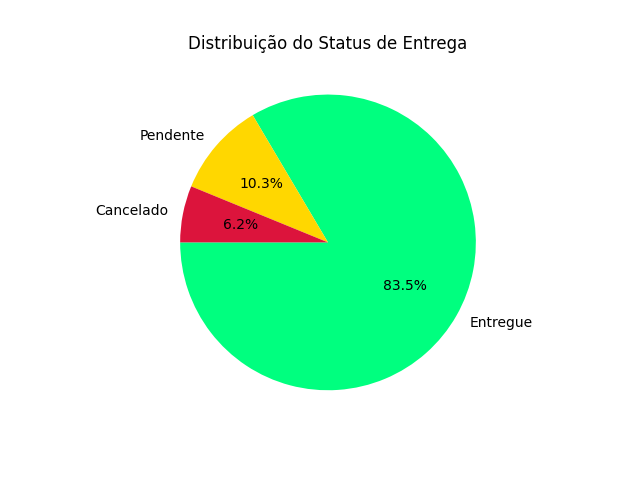
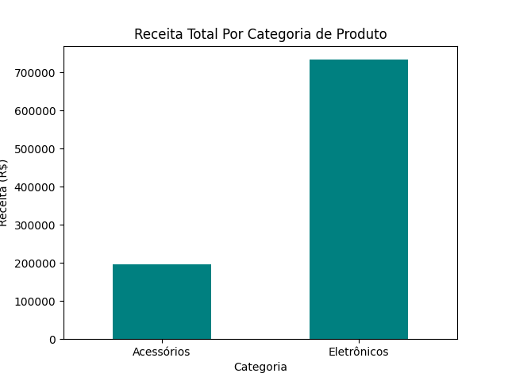
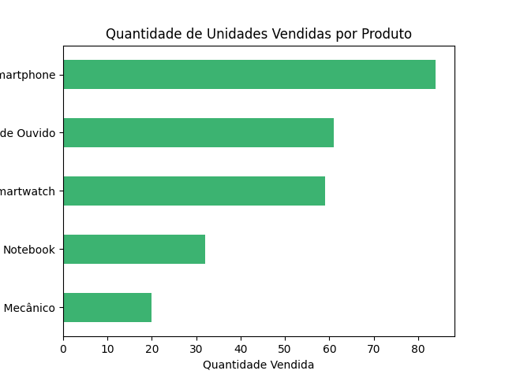
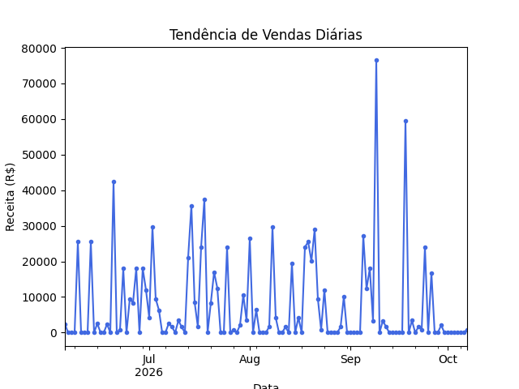

# Relatório Executivo de Análise de Vendas

**Data do Relatório:** Março de 2026  
**Período Analisado:** Série temporal completa de transações

---

## 1. Visão Geral do Projeto

Este projeto visa realizar uma análise completa do desempenho de vendas da organização através de uma abordagem sistemática de limpeza, processamento e análise de dados. O objetivo principal é identificar **padrões de vendas, categorias mais lucrativas, produtos mais vendidos e tendências temporais** que permitam embasar decisões estratégicas de negócio.

A análise foi desenvolvida com foco em:
- Garantir a qualidade dos dados
- Extrair métricas-chave de negócio
- Visualizar insights de forma clara e acessível
- Fornecer recomendações acionáveis

---

## 2. Preparação dos Dados

A etapa de preparação dos dados é fundamental para garantir a confiabilidade da análise. As seguintes transformações foram aplicadas ao conjunto de dados bruto:

### Limpeza e Transformação de Dados

| Ação | Descrição |
|------|-----------|
| **Conversão de Tipos** | Conversão de `Preco_Unitario` para numérico e `Cliente_ID` para inteiro |
| **Tratamento de Datas** | Padronização de `Data_Compra` para formato datetime |
| **Preenchimento de Valores Ausentes** | Coluna `Quantidade` preenchida com a mediana (robusto a outliers) |
| | Coluna `Status_Entrega` preenchida com a moda (valor mais frequente) |
| **Remoção de Dados Incompletos** | Remoção de linhas com `Cliente_ID` ou `Preco_Unitario` faltantes |
| **Remoção de Duplicatas** | Eliminação de registros duplicados |
| **Tratamento de Outliers** | Remoção de valores em `Quantidade` além de 3 desvios padrão da média |

Essas etapas asseguram que os dados utilizados na análise são confiáveis e representativos do negócio real.

---

## 3. Principais Métricas de Negócio

### Indicadores-Chave de Desempenho (KPIs)

#### 💰 Receita Total de Vendas

A receita total de vendas é agregada a partir do produto da quantidade vendida pelo preço unitário de cada transação. Esta métrica reflete o desempenho financeiro geral do período analisado.

#### 📊 Distribuição de Vendas

- **Total de Produtos Únicos:** Portfólio diversificado de produtos
- **Total de Clientes:** Base de clientela ativa
- **Número de Transações:** Volume total de operações realizadas

#### 📦 Status de Entrega

A distribuição do status de entrega mostra a qualidade operacional do processo logístico:
- **Entregues:** Pedidos completados com sucesso
- **Pendentes:** Pedidos em processamento
- **Cancelados:** Pedidos não realizados

---

## 4. Receita por Categoria

### Análise de Categorias de Produto

A análise de receita por categoria revela quais segmentos de produto contribuem mais significativamente para o faturamento total. Este insight é crítico para:

- **Alocação de Recursos:** Direcionar investimentos para categorias de maior retorno
- **Estratégia de Estoque:** Priorizar categorias com melhor performance
- **Decisões de Marketing:** Amplificar promoções em categorias rentáveis

#### Produtos Mais Vendidos (por volume)

O gráfico acima identifica os produtos com maior volume de vendas. Produtos de alto volume não necessariamente geram maior receita se o preço unitário for baixo.

#### Tendência Temporal de Vendas

A análise temporal permite identificar:

- **Padrões Sazonais:** Períodos de pico e vale nas vendas
- **Tendências de Crescimento:** Aumento ou queda na receita ao longo do tempo
- **Oportunidades de Otimização:** Períodos com baixo desempenho que requerem ação

---

## Recomendações Estratégicas

Com base na análise realizada, recomendamos:

1. **Foco em Categorias de Alto Retorno:** Investir em marketing e estoque nas categorias mais lucrativas
2. **Análise de Sazonalidade:** Preparar estratégias proativas para períodos de baixa demanda
3. **Otimização Logística:** Monitorar continuamente o status de entrega para minimizar cancelamentos
4. **Revisão de Portfólio:** Avaliar produtos de baixa venda e baixa margem para possível descontinuação

---

## Conclusão

Esta análise fornece uma base sólida para decisões estratégicas fundamentadas em dados. Os insights gerados devem ser acompanhados regularmente para garantir que as estratégias implementadas estão gerando os resultados esperados.

**Para análises mais detalhadas e exploratórias, consulte os notebooks de análise disponíveis no projeto.**
